# Creating a WordPress Blog on Lightsail in 5 minutes

In this post we'll create a barebones WordPress site hosted on Amazon Lightsail. We'll just focus on getting the site up and running as fast as possible so we'll leave out HTTPS and DNS configuration. By the end of these steps, you'll have a site that is:

- hosted on Amazon Lightsail
- running WordPress from an official Bitnami image
- customizable via the Wordpress admin console

Before starting this tutorial, review the [pricing guide](https://aws.amazon.com/lightsail/pricing/) for Lightsail. 

- [Creating a WordPress Blog on Lightsail in 5 minutes](#creating-a-wordpress-blog-on-lightsail-in-5-minutes)
  - [Part 1. (Option A) Creating your blog via aws cli](#part-1-option-a-creating-your-blog-via-aws-cli)
      - [`cmd`: create an instance from an official Bitnami WordPress image.](#cmd-create-an-instance-from-an-official-bitnami-wordpress-image)
      - [`cmd`: get the public IP address of the new instance:](#cmd-get-the-public-ip-address-of-the-new-instance)
  - [Part 1. (Option B) Creating your blog via Lightsail Web Console](#part-1-option-b-creating-your-blog-via-lightsail-web-console)
  - [Part 2. Customizing your blog](#part-2-customizing-your-blog)
  - [Final notes](#final-notes)


## Part 1. (Option A) Creating your blog via aws cli 

If you do not have [aws cli](https://aws.amazon.com/cli/) installed on your machine, you'll want to follow the steps in the [next section](#part-1-option-b-creating-your-blog-via-lightsail-web-console). 

If you have it installed, you can run the following commands in a terminal. 

#### `cmd`: create an instance from an official Bitnami WordPress image. 

```
aws lightsail create-instances --instance-names wordpress_blog --availability-zone us-east-1a --blueprint-id wordpress/1 --bundle-id nano_2_0
```

#### `cmd`: get the public IP address of the new instance:


```
aws lightsail get-instance --instance-name wordpress_blog | grep publicIpAddress
```


> `"publicIpAddress": "34.205.54.197",`

you can enter that public IP address into a browser and load your site:

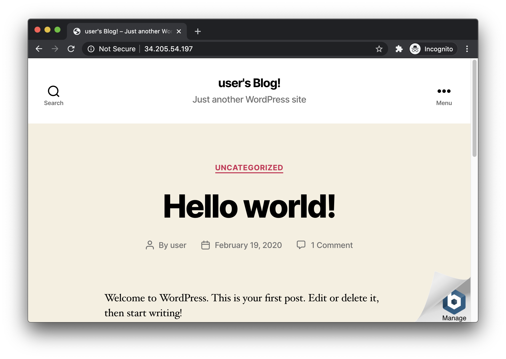

## Part 1. (Option B) Creating your blog via Lightsail Web Console 

This way is pretty easy as well. Just hit `Create instance` on the [Lightsail home page](https://lightsail.aws.amazon.com/ls/webapp/home/instances).

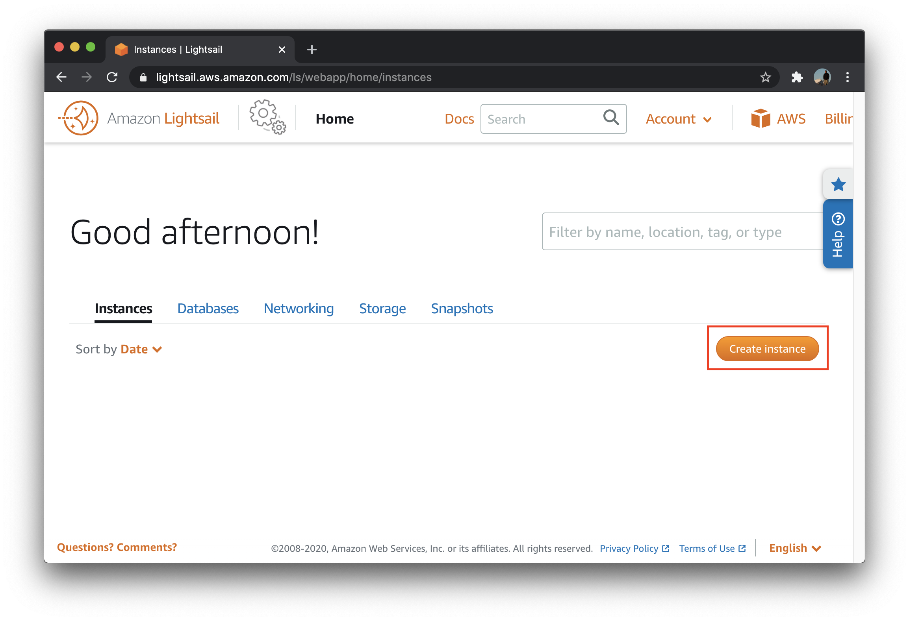

You'll be asked to select some instance configurations. I recommend just sticking with the defaults they give you. 

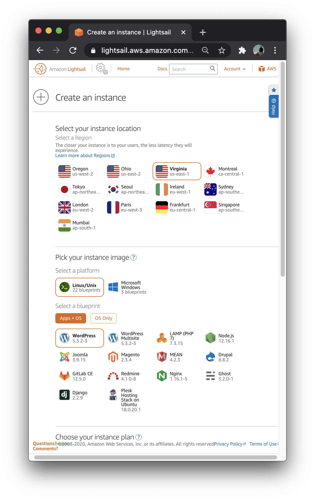

Name your instance something you'll remember. I'm going to name mine `wordpress_blog`.

Hit `Create instance` once you're done configuring. 

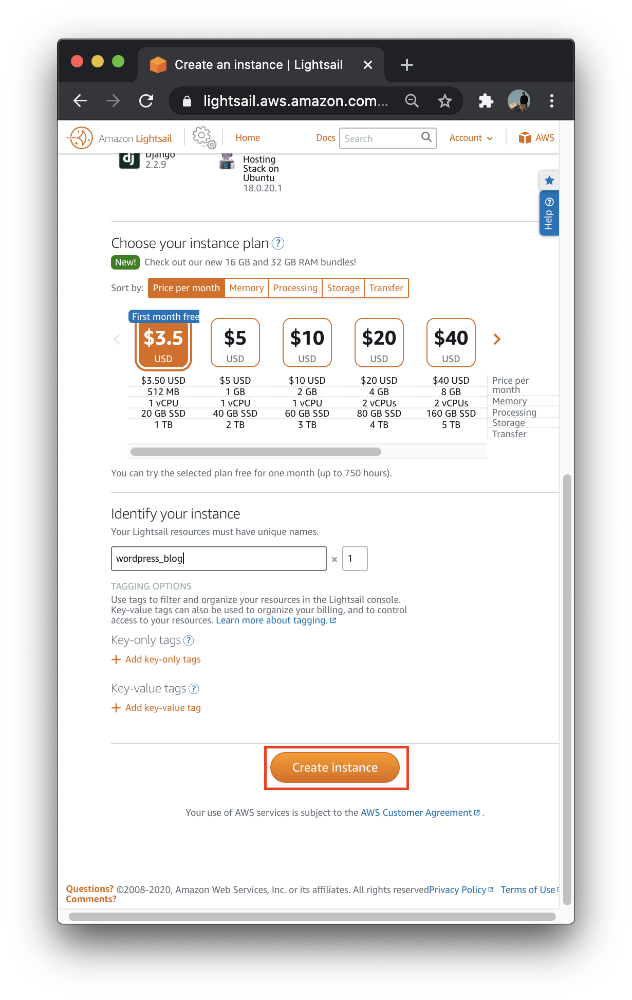

Lightsail will spin up an instance running the Wordpress image provided by Bitnami. This might take a couple minutes.

You'll see a public IP address on the instance. 

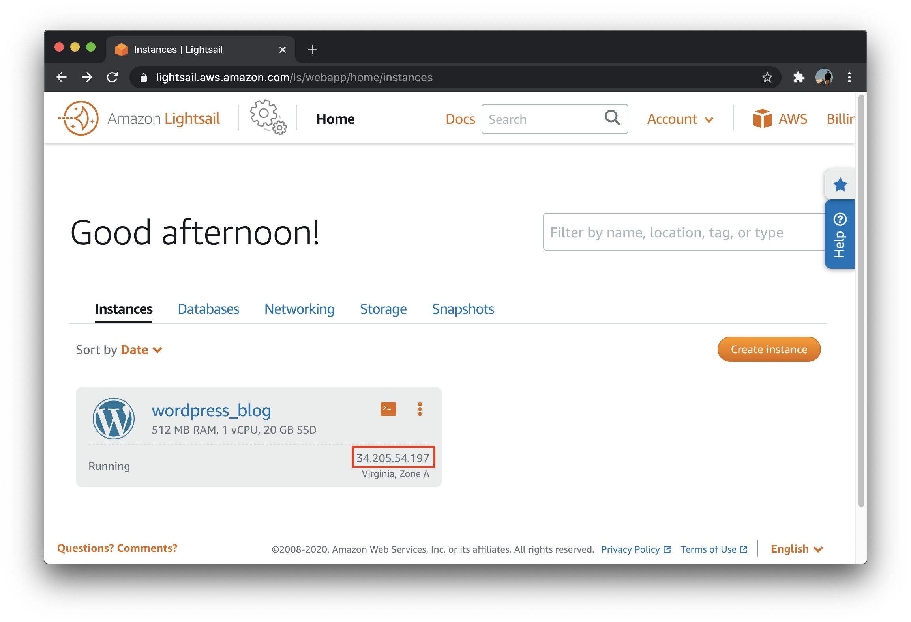

Once the instance is ready, you can enter that public IP address into a browser.


## Part 2. Customizing your blog

Now we want to customize our blog. In order to demonstrate how this is done we'll just change the background color. 

To customize our site, we'll need to access the WordPress admin console. To get your password for the admin console, head back to your instance on Lightsail and hit `Connect using SSH`.

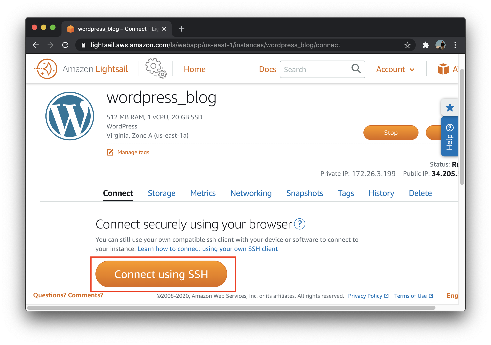

A web terminal will pop up. 

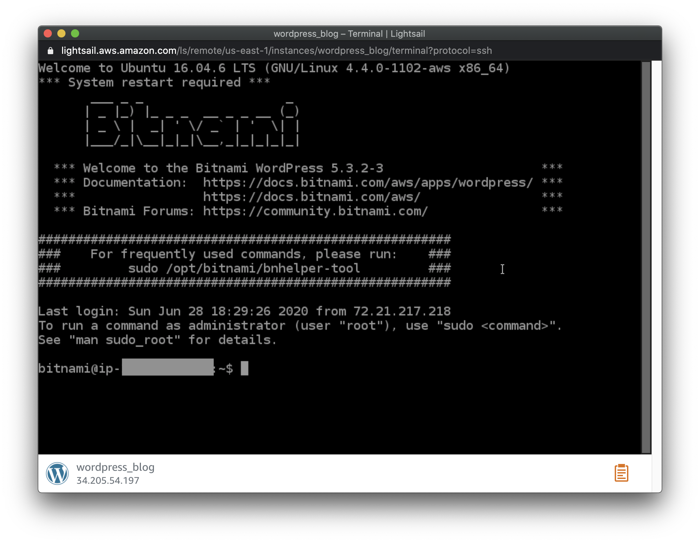

Enter the following command to get your password:

```
sudo cat /home/bitnami/bitnami_credentials
```

> `The default username and password is 'user' and '<password>'.`

Copy that password and head back to your site. Click the Bitnami `Manage` button in the bottom corner.

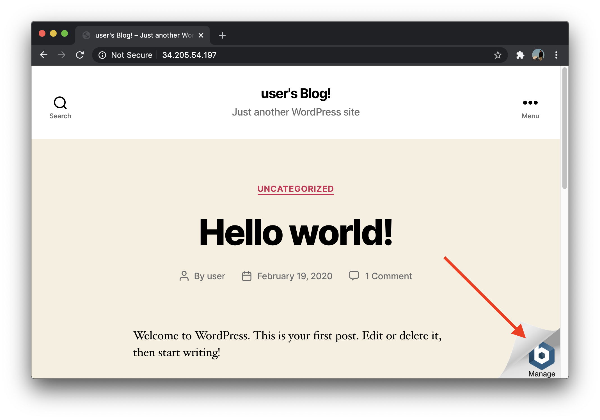

Here you can login to the WordPress admin console.

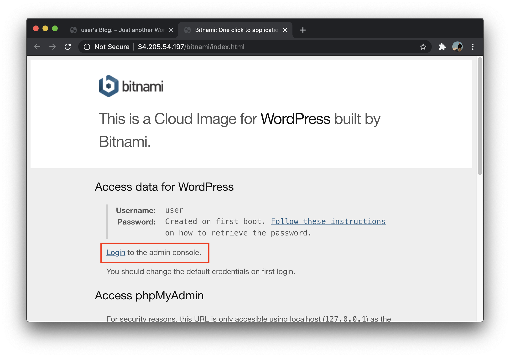

Enter the username `user` and paste in your password.

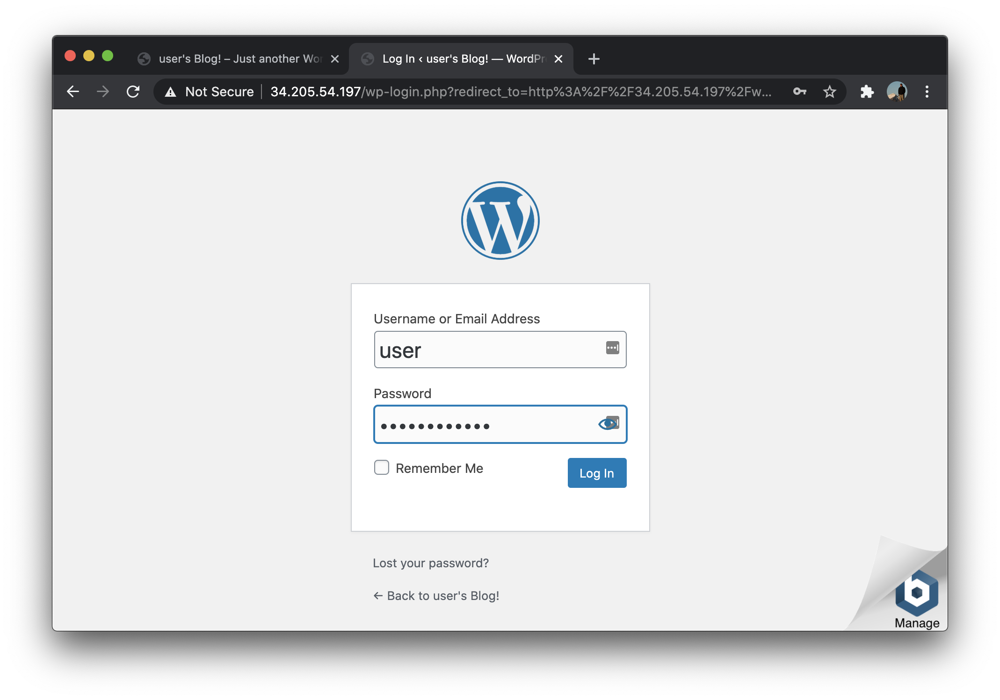

Once logged in, you can start customizing your site. I recommend bookmarking this page.

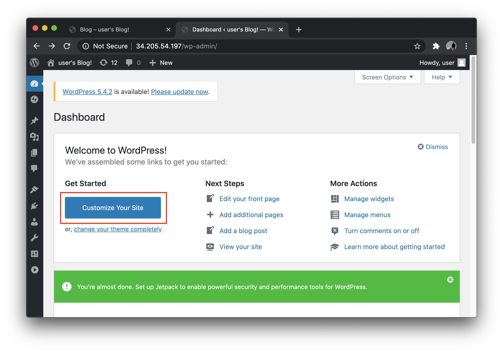

I did a trivial change to the site by going to `Colors => Background Color` and changing the color to blue.

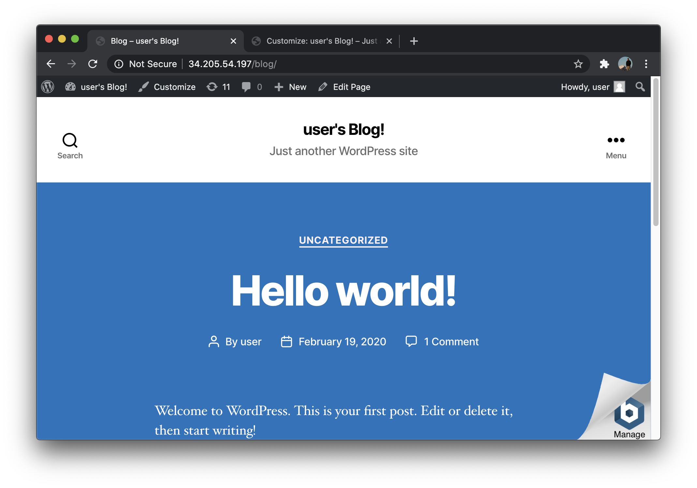

That's it - you have a customizable WordPress site! 

## Final notes

We left out HTTPS and DNS configuration in this tutorial. Adding those two things will allow your site to be reachable from a custom URL and will remove any warnings your visitors have about `Not Secure` connections.

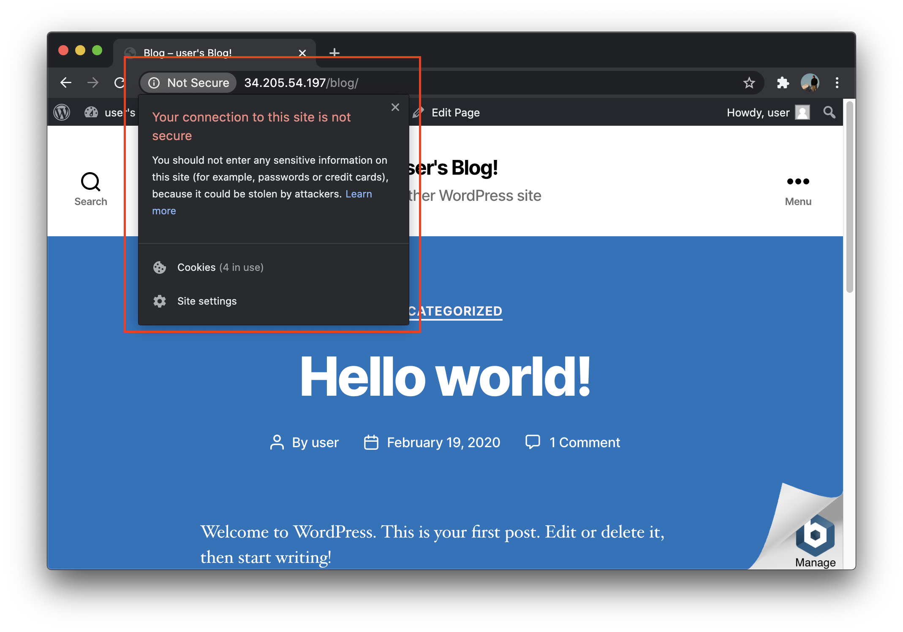

We'll fix those two things in some upcoming posts. But if you want to figure them out for youself, here are the two resources I would use:

- [Tutorial: Using Let’s Encrypt SSL certificates with your WordPress instance in Amazon Lightsail](https://lightsail.aws.amazon.com/ls/docs/en_us/articles/amazon-lightsail-using-lets-encrypt-certificates-with-wordpress)

- [Create a Lightsail static IP address and attach it to your WordPress instance](https://lightsail.aws.amazon.com/ls/docs/en_us/articles/amazon-lightsail-tutorial-launching-and-configuring-wordpress#tutorial-launching-and-configuring-wordpress-creating-a-lightsail-static-ip)
  

